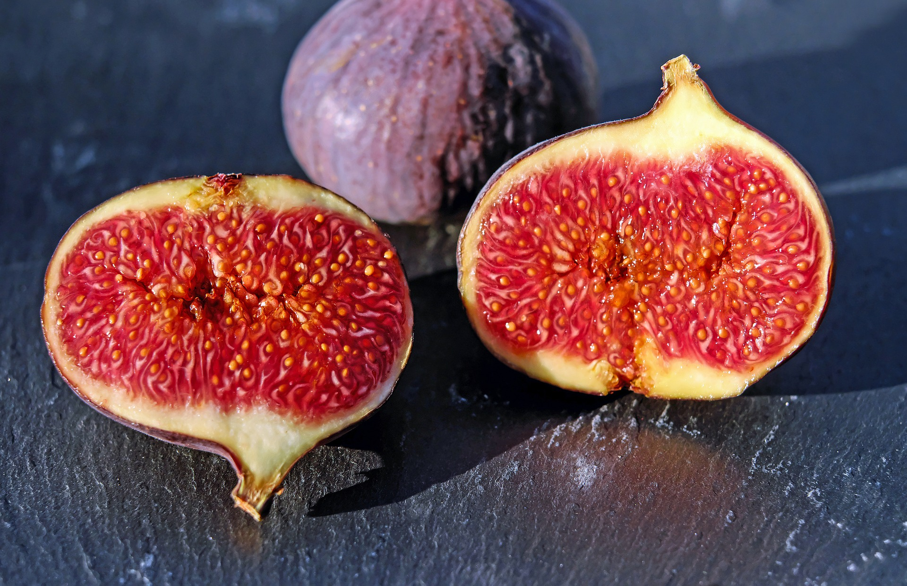

DIETOLOGY lecture notes 
=======================

prof. Zabolotny lectures

[1-st lecture](https://www.youtube.com/watch?v=ks2CiWG2_Lc)
------------

 * Law of Food Supply - a basis of biological life: material resource supplement of an individual genetic plan of grows - the only way to grow healthy human
 * Law of Natural selection - the one who did not adapt to an environment not survive or not able to leave viable offsprings. (applied to food supply)
 * 80% of the population starving - deprived of adequate nutrition
 * 40% infertile(mostly connected to disgusting food habits)
 * taste - way to find required food supply. Highly important to taste the big variety of food and follow developed food sense.

[2-nd Lecture](https://www.youtube.com/watch?v=V-rGJ5exGos)
-----------------------------------------------------------

Proteins:
 * Functions(priority order): 
   1. structure
   2. transport (albumins, lipoprotein/cholesterol)
   3. immune (globulins)
   4. fermentation (protease, lipase, amylase)
   5. hereditary (DNA)
 * Sources(importance order):
   1. milk and milk derivatives
   2. animal protein (locomotion)
   3. plant protein: (top: lentils, soya bean, bean)
 * Aminoacids in proteins:
   1. milk - all 20 amino acids
   2. animal - all 20 amino acids (but most % for muscles)
   3. plant - only 8 amino acids
 * Dietary supplement:
  * fish oil. more better, no limits
  * lecithin (phosphatidylcholine). more better, no limits
  * essential oil (adding to food). each has own function

 * more proteins - better
 * albumins do not survive in more than 42 degree Celsius
 * fermentation(enzyme) deficiency - most popular deficit of proteins, but easy to correct
 * receptor imprinting - calibration of teste happening during first food experience
 * milk - one of greatest mechanisms adaptation in nature
 * eating more similar structures(of animals) required to build similar structures in our body. so eating different internals alike liver, heart and even brains(fish head) is good
 * it is required to have all 20 amino acids for the healthy body
 * all people differ in a requirement of specific amino acids. this means every family member should have own diet and find food himself(so buying food/cooking by one family member may be not perfect only because amino acid requirements may be different)
 * ideal protein - egg white

[3-rd Lecture](https://www.youtube.com/watch?v=OPo9U-PE6s4) and [4-th Lecture](https://www.youtube.com/watch?v=RQ2tJGHxHas)
---------------------------------------------------------------------------------------------------------------------------

Fats:
 * Functions(priority order)
   1. Breathing (surfactant)
   2. Cell membrane
   3. Hormones
   4. Heat production

 * Sources(importance order):
   1. animal fats: egg, caviar, internal organ fats, butter
   2. plant fats: olive oil, grape oil, linseed oil, cedar oil 

 * fat is important in exchange of O2 and CO2 in lungs. fats cover alveoli 
 * alveoli is most vulnerable to pollution/infections in breathing system. no natural way of cleaning up. cleaning up alveoli can be done with halogenerator
 * Top O2 consumers: muscles, neurons, feeding
 * with good oxygen level(aerobic glycolysis): glucose + O2 => 36 ATP(energy battery) + CO2 + H20. 
 * without oxygen level(anaerobic glycolysis) other reaction: glucose -> 6ATP + 30 lactic acid (6 times less energy + toxic acid)
 * fat(cell membrane) covers protein. cell membrane dielectric and generates a potential difference between outer side and the inner side(electric energy).
 * hormones are generated from fats
 * from childhood till puberty all feeding is directed towards growth. this is controlled by steroid hormones. switching to puberty turns on steroids and stops growth.
 * fats burn very slow and generating heat
 * body temperature below 36.4C degree means deficiency of fats
 * animal fats best for surfactant and cell membrane building
 * plant fats are reactogenic. unsaturated fats good for many different reactions by saturating with required molecules 
 * ideal fat - egg yolk, caviar
 * main plant fat food rule is a diversity of many plant oils. at least 5 oils, at least 6 tablespoons per day.
 * oil storage rules: no oxygen, no sunlight
 * second health food rule: fat requirement raises with latitude and altitude up to 80%
 * refined oil better for frying(high temperature), non-refined for everything else

[5-rd Lecture](https://www.youtube.com/watch?v=VAbNK7ABVw8)
-----------------------------------------------------------

Carbohydrates:
